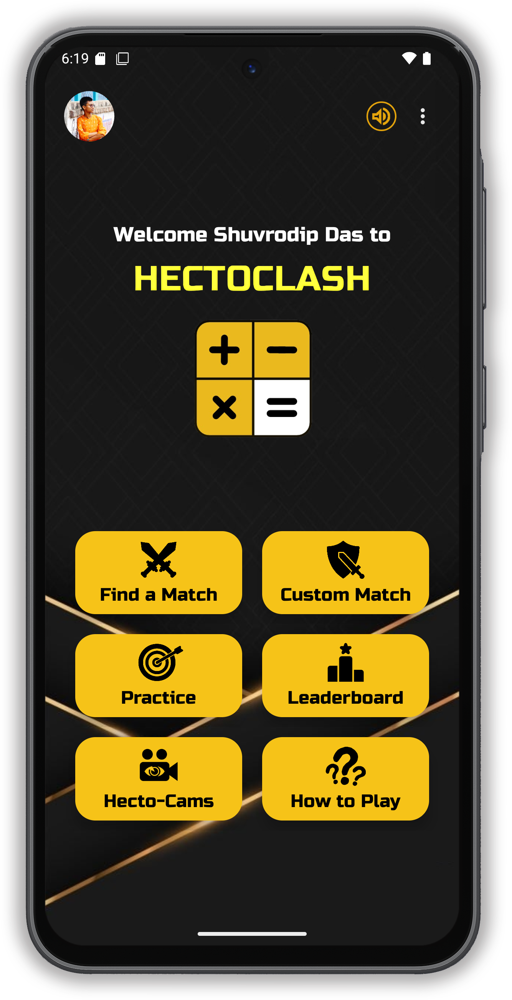
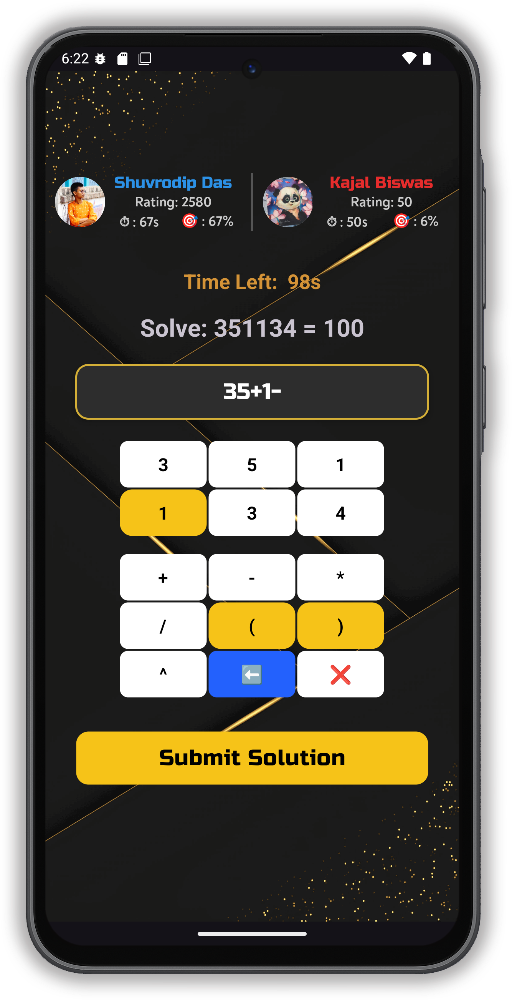
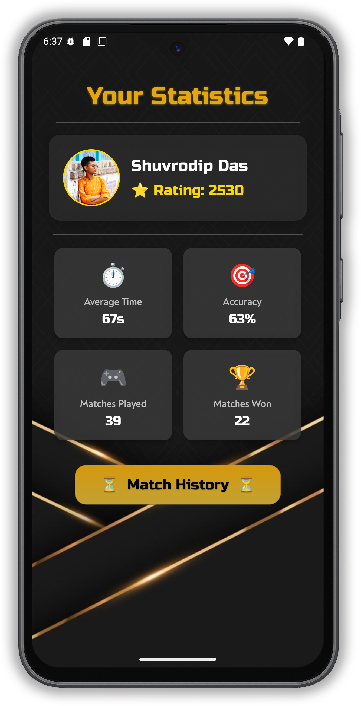
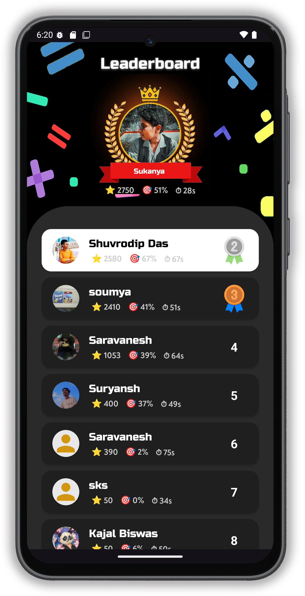
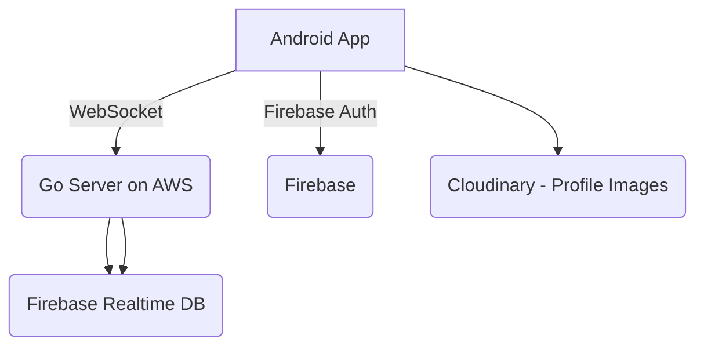

# 🧠 HectoClash – The Ultimate Mental Math Duel

HectoClash is a real-time, competitive mental math game where players duel to solve Hectoc-style puzzles under time pressure. Originally built during Hackfest 2025 and later expanded into a full-featured multiplayer game.

<p align="center">
  
  
</p>

---

## 📸 Preview

<p align="center">
  
  
  
  
</p>

---

## 🎮 Gameplay Highlights

- 🔁 Real-time 1v1 matchmaking  
- 🧩 Hectoc puzzle-based mental math challenges  
- 👥 Private rooms with code & password  
- 👀 Live spectating support (public & private matches)  
- 🤖 Single-player practice mode  
- 📊 Match history & detailed post-game reports  
- 📈 Stats tracking (accuracy, rating, solve time, win/loss)  
- 🏆 Global leaderboard based on average solving time  
- 🔐 Secure login/signup (Firebase Auth)  
- 🖼️ Profile picture upload with Cloudinary  

---

## 💡 The Problem

Traditional mental math games are often:

- Isolated & single-player  
- Lacking feedback or learning mechanisms  
- Repetitive and non-interactive  
- Missing any sense of real-time competition  

---

## ✅ The Solution

HectoClash introduces:

- ⚔️ Real-time duels with matchmaking  
- 🔁 Match reports with solution breakdowns  
- 👥 Spectator mode & private custom rooms  
- 📚 Practice mode for learning  
- 📊 Analytics dashboard to track improvement  
- 💡 A gamified way to boost mental aptitude  

---

## 🛠️ Tech Stack

| Layer           | Technology Used            |
|----------------|-----------------------------|
| Frontend        | Kotlin (Android)           |
| Backend         | Golang + WebSocket         |
| Hosting         | AWS EC2                    |
| Authentication  | Firebase Auth              |
| Realtime Data   | Firebase Realtime Database |
| Media Storage   | Cloudinary (Profile Pics)  |
| Web Version     | Built with JS, CSS and HTML |

---

## 📐 Architecture



---

## 🧪 How to Run (Code Style)

### 1️⃣ Clone the repository
```bash
git clone https://github.com/suryanshukla592/hectoclash.git
git clone https://github.com/suryanshukla592/HectoClash_GoLand.git
cd hectoclash
```

### 2️⃣ Set up Firebase
- Go to https://console.firebase.google.com  
- Create a project  
- Enable **Authentication** and **Realtime Database**  
- Download `google-services.json`  
- Place it inside:
```bash
/app/google-services.json
```

### 3️⃣ Run the Go backend
Install Go:
```bash
sudo apt install golang-go
```

Navigate to the server folder:
```bash
cd server/
go run main.go
```

Make sure WebSocket server is running on:
```
ws://<your-ip>:PORT/ws
```

### 4️⃣ Build and run the Android app

In Android Studio terminal:
```bash
./gradlew clean
./gradlew build
./gradlew installDebug
```

Make sure device/emulator is running.

---

## 🙌 Credits

- Developed by Shuvrodip, Saravanesh, Soumya and Suryansh at Hackfest 2025 🙏
